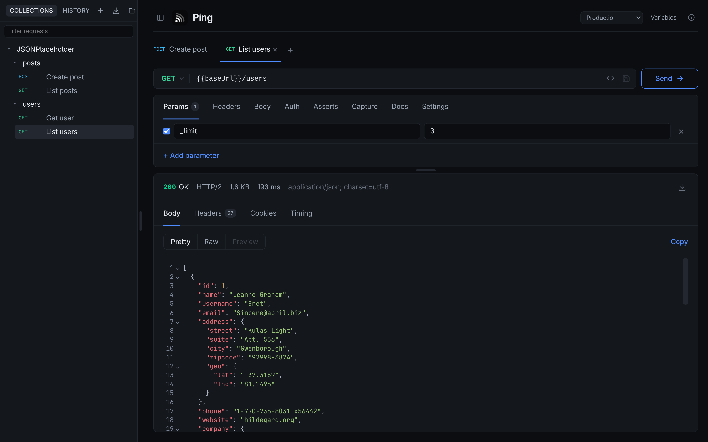
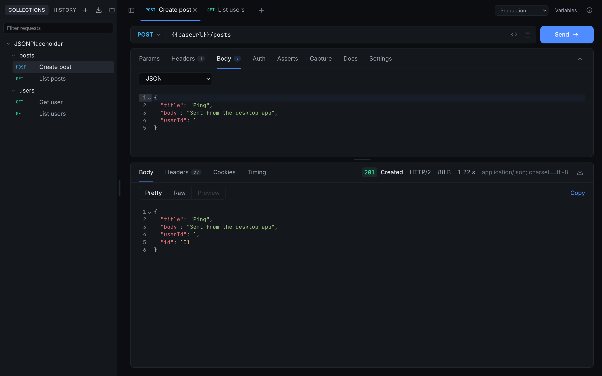
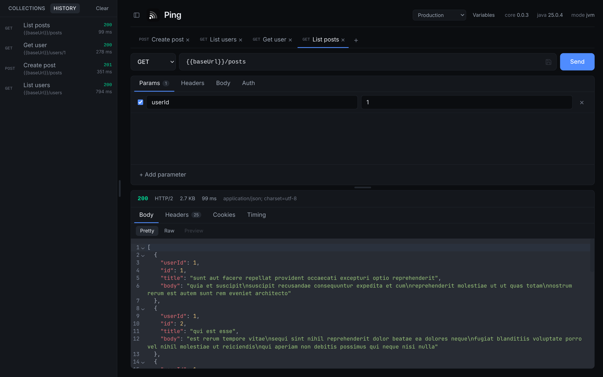
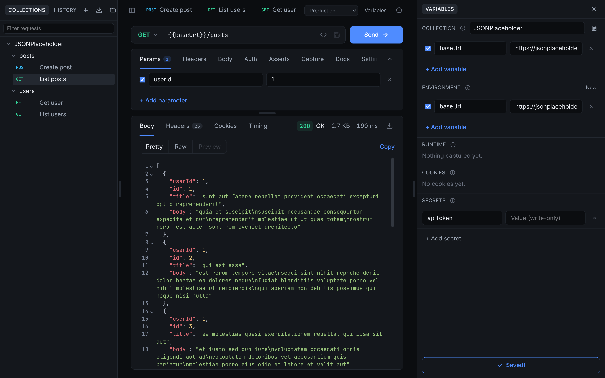

<p align="center">
  
</p>

<h1 align="center">Ping</h1>

<p align="center">
  A fast, privacy-first HTTP client that runs entirely on your machine.
</p>

<p align="center">
  <a href="https://github.com/dbohry/ping/actions/workflows/ci.yml"></a>
  <a href="https://github.com/dbohry/ping/releases"></a>
</p>

Requests, responses, collections and secrets never leave your computer. There is no account,
no cloud sync and no telemetry — just a native engine, a YAML folder you own, and a fast UI.

## Features

- **Native speed.** The engine is Java compiled ahead of time with GraalVM `native-image`.
  It starts in milliseconds and bundles no JRE.
- **Collections are plain files.** A folder per collection, a YAML file per request. Keep
  them in Git, sync them however you like, and read them without the app.
- **Variables and environments.** Interpolate `{{name}}` anywhere, define collection-wide
  values, and override them per environment. Typing `{{` offers every name in scope.
- **Secrets stay out of your files.** Values live in the OS keychain via Electron
  `safeStorage`; collections hold only the reference. A credential typed into a request is
  moved out of the file for you.
- **Everything a request needs.** Methods, query params, headers, form, multipart and JSON
  bodies with syntax highlighting, files from disk, redirects, timeouts, cancellation, and
  Bearer, Basic, API-key and OAuth2 auth. Copy any request as a `curl` command.
- **Assertions and capture.** Check status, headers and body values on every send, and
  capture response values into runtime variables for the next request.
- **Real network conditions.** HTTP proxies, client certificates for mutual TLS, a
  session-only cookie jar per collection and environment, and streaming for SSE and NDJSON.
- **A response viewer that gets out of the way.** Pretty, raw, HTML preview, images and
  PDFs rendered in place, headers, cookies, a per-phase timing breakdown, and saving the
  body to disk.
- **Bring your collections along.** Import curl commands, Postman and Insomnia collections,
  and OpenAPI 3 documents; keep Markdown notes on any request or collection.
- **Run a whole collection.** Every request in order, with its assertions, from the sidebar
  or from the command line — the same engine either way, so CI and the app agree.
- **Updates you approve.** The packaged app checks for a new release and never downloads or
  installs without your yes.
- **Built for the keyboard.** A `⌘K` command palette, `⌘↵` to send, `⌘S` to save, and tabs
  that keep several requests in flight at once.

## Screenshots

Compose and send with a full editor:



| History | Variables, cookies and secrets |
|:---:|:---:|
|  |  |
| Every exchange, newest first and searchable, with credentials blanked. | Collection and environment variables, captured runtime values, cookies, and secrets kept in the OS keychain. |

## Quick start

You need **Java 25** to build the core and **Node.js 26** for the desktop shell.
[GraalVM](https://www.graalvm.org/) 25 is additionally required for native images and
packaging.

```sh
make setup   # install desktop dependencies and build the core
make dev     # build the core, then start Electron with hot reload
```

On first run, with no folder open, Ping creates `~/Ping` with a starter collection so you
have something to send. The dev server does not rebuild Java: after editing the core, run
`make core` and restart.

## How it fits together

Three layers, talking over newline-delimited JSON-RPC 2.0 on stdio:

- **Core** — a headless Java 25 process that does the real work: HTTP, timing, redirects,
  cancellation, `{{variable}}` interpolation, auth flows and token exchange, and the YAML
  collection store. Compiled with GraalVM `native-image` for releases.
- **Shell** — Electron with a TypeScript main process: window and menus, file dialogs,
  filesystem watching, secrets in `safeStorage`, dialogs, and process lifecycle.
- **UI** — Svelte 5 with Tailwind v4 and CodeMirror 6, sandboxed with no Node access.
  Everything it needs crosses one `core:request` choke point.

## Commands

| Command     | Purpose                                              |
|-------------|------------------------------------------------------|
| `make setup`| Install desktop dependencies and build the core      |
| `make dev`  | Build the core, then start Electron with hot reload  |
| `make core` | Rebuild the core after changing Java sources         |
| `make test` | Run the core test suite on the JVM                   |
| `make build`| Production build                                     |
| `make check`| Type-check the desktop shell and run its unit tests  |
| `make smoke`| Build the desktop and drive the UI over CDP          |
| `make package`| Build the native core and package for this OS      |
| `make native`| Compile the core to a native image (minutes)        |
| `make native-test`| Run the suite compiled as a native image       |
| `make agent`| Regenerate native-image reachability metadata        |
| `make ci-run`| Drive the runner CLI against a loopback server (`BIN=` for native) |

## Layout

```
ping/
├─ core/        Gradle, Java — the engine
├─ desktop/     electron-vite — main process, preload, Svelte UI
├─ contract/    JSON Schema — source of truth for the RPC boundary
└─ docs/        PLAN.md (phases and rationale), REVIEW.md (open findings)
```

## Documentation

- `docs/PLAN.md` — the stack rationale and the numbered phase plan.
- `contract/README.md` — the RPC protocol and method list.
- `CLAUDE.md` — conventions and the rules that keep the layers apart.

The screenshots are generated from the built app against a real, throwaway collection.
After `make build`, run `npm run screenshots --prefix desktop` to regenerate them into
`docs/screenshots/`.
